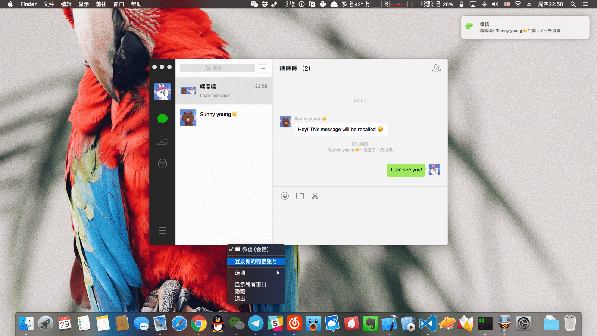
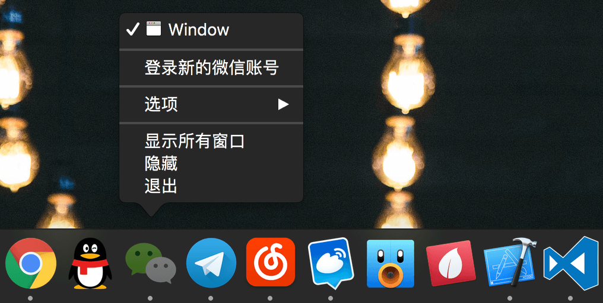
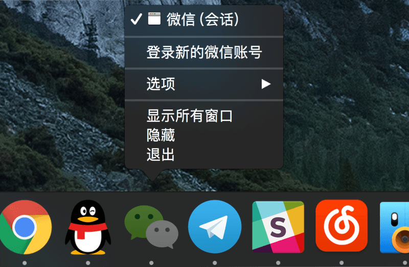

# WeChatTweak-macOS

[](LICENSE)
[](README-English.md)
[](README.md)
[](https://t.me/joinchat/B0vW8kPU5OrwdC1qRbaqRA)
[](#backers)
[](#sponsors)
[](https://github.com/Sunnyyoung/WeChatTweak-macOS/releases/latest/download/WeChatTweak-macOS.zip)

微信 macOS 客户端增强 Tweak 动态库。

## 截图

### 整体预览



### Alfred workflow



### LaunchBar action



## 功能

- 阻止消息撤回
  - 消息列表通知
  - 系统通知
  - 正常撤回自己发出的消息
- 客户端无限多开
  - 右键 Dock icon 登录新的微信账号
  - 命令行执行：`open -n /Applications/WeChat.app`
- 消息处理增强
  - 支持任意表情导出
  - 支持二维码识别
  - 支持右键直接复制链接
  - 支持由系统默认浏览器直接打开
- 重新打开应用无需手机认证
- UI界面设置面板
- 支持 Alfred workflow
- 支持 Launchbar action

## 使用

```bash
$ cd WeChatTweak-macOS
$ sudo make install   # 安装或者更新动态库
$ sudo make uninstall # 卸载动态库
```

## FAQ

1. 功能失效？  
  当前支持并经验证版本：`3.0.2`，若使用上仍有问题请 [Submit issue](https://github.com/Sunnyyoung/WeChatTweak-macOS/issues/new).
2. Issue 没有响应 or 回复？  
  开源项目，用爱发电，耐心等。
3. 兼容旧版本客户端吗？  
  不，为了降低维护成本和保证更新速度，默认只支持最新 App Store 版本客户端。
4. 安装出现错误：`Can not find the framework, please build first.`  
  下载的是源码文件需要自行编译，开箱即用请点击：[](https://github.com/Sunnyyoung/WeChatTweak-macOS/releases/latest/download/WeChatTweak-macOS.zip)

## 参考

- [微信 macOS 客户端无限多开功能实践](https://blog.sunnyyoung.net/wei-xin-macos-ke-hu-duan-wu-xian-duo-kai-gong-neng-shi-jian/)
- [微信 macOS 客户端拦截撤回功能实践](https://blog.sunnyyoung.net/wei-xin-macos-ke-hu-duan-lan-jie-che-hui-gong-neng-shi-jian/)
- [让微信 macOS 客户端支持 Alfred](https://blog.sunnyyoung.net/rang-wei-xin-macos-ke-hu-duan-zhi-chi-alfred/)

## 贡献者

This project exists thanks to all the people who contribute. [[Contribute](CONTRIBUTING.md)].

[](https://github.com/Sunnyyoung/WeChatTweak-macOS/graphs/contributors)

## 支持者

Thank you to all our backers! 🙏 [[Become a backer](https://opencollective.com/WeChatTweak-macOS#backer)]

[](https://opencollective.com/WeChatTweak-macOS#backers)

## 赞助者

Support this project by becoming a sponsor. Your logo will show up here with a link to your website. [[Become a sponsor](https://opencollective.com/WeChatTweak-macOS#sponsor)]

[](https://opencollective.com/WeChatTweak-macOS/sponsor/0/website)
[](https://opencollective.com/WeChatTweak-macOS/sponsor/1/website)
[](https://opencollective.com/WeChatTweak-macOS/sponsor/2/website)
[](https://opencollective.com/WeChatTweak-macOS/sponsor/3/website)
[](https://opencollective.com/WeChatTweak-macOS/sponsor/4/website)
[](https://opencollective.com/WeChatTweak-macOS/sponsor/5/website)
[](https://opencollective.com/WeChatTweak-macOS/sponsor/6/website)
[](https://opencollective.com/WeChatTweak-macOS/sponsor/7/website)
[](https://opencollective.com/WeChatTweak-macOS/sponsor/8/website)
[](https://opencollective.com/WeChatTweak-macOS/sponsor/9/website)

## License

The [Apache License 2.0](LICENSE).
